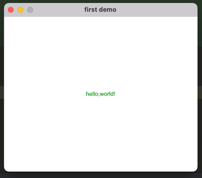

# slint-in-action
slint使用了声明式编程来简化UI的开发，优化应用程序开发和性能的方法如下：
- 用声明式语言来描述UI，使用的语法提供了一种广泛的方式来描述各种图形元素，同时易于阅读、编写和学习。
- slint编译器对描述UI的代码进行优化并翻译成原生代码。
- 采用任何语言编写的业务逻辑，可通过使用slint提供的特定于语言的API与UI连接。

# First demo
1. 执行cargo new helloworld命令创建一个Rust应用程序。
2. 在Cargo.toml文件中添加如下依赖
```toml
[dependencies]
slint = "1.8.0"

# 构建时的依赖
[build-dependencies]
slint-build = "1.8.0"
```

3. 创建ui目录，并创建hello.slint文件，添加如下ui代码：
```
// 定义slint界面
export component HelloWorld inherits Window {
    title: "first demo";
    height: 320px;
    width: 400px;

    // 定义一个文本框
    Text {
        text:"hello,world!";
        color:green;
    }
}
```
4. 在根目录下创建build.rs文件，用于程序构建之前的前置操作，代码如下：
```rust
// 构建之前运行的操作
fn main() {
    slint_build::compile("ui/hello.slint").unwrap();
}
```
在构建之前会先执行build.rs文件中的操作，也就是根据slint ui文件生成对应的组件代码。
5. 在src/main.rs中添加如下代码
```rust
// 引入从构建脚本中使用slint-build crate生成的rust代码
slint::include_modules!();
fn main() {
    println!("Hello, world!");
    // HelloWorld 名字是hello.slint文件指定的
    HelloWorld::new().unwrap().run().unwrap();
}
```
6. 运行cargo run命令，效果如下图所示


# Slint arch
https://github.com/slint-ui/slint/?tab=readme-ov-file#architecture

# Slint doc
- https://github.com/slint-ui/slint
- https://docs.slint.dev/
